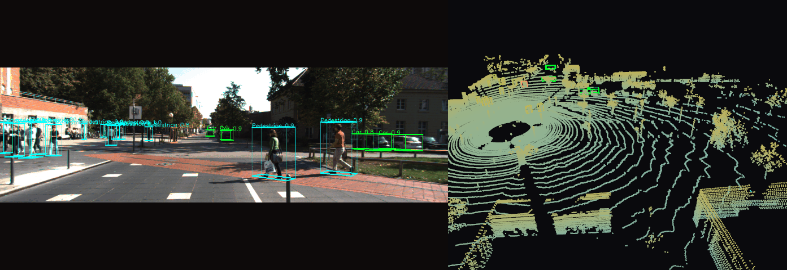
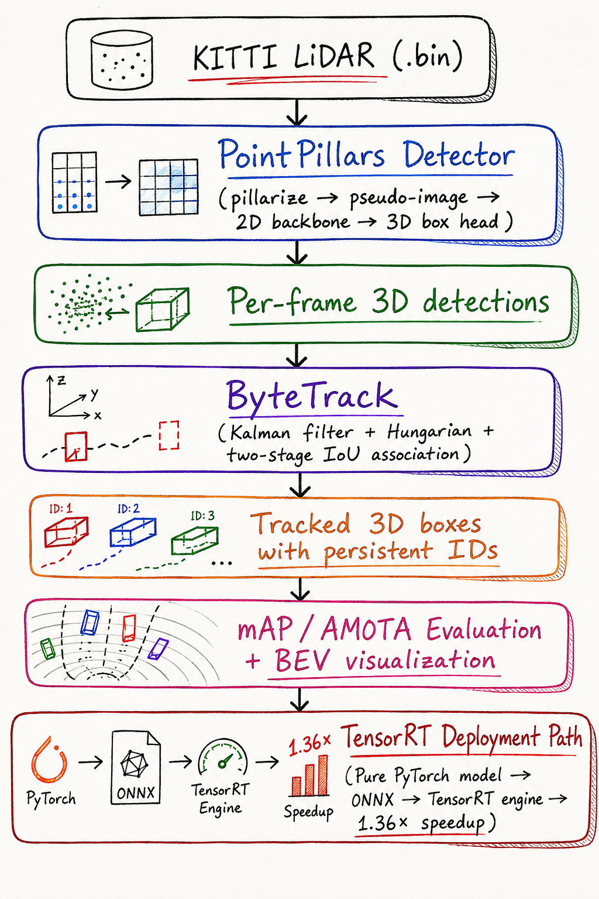

# 3D Object Detection \& Tracking on KITTI

<p align="center">
  
</p>

<p align="center">
  <b>PointPillars 3D detection + ByteTrack multi-object tracking on KITTI.</b><br>
  End-to-end pipeline from raw LiDAR point clouds to tracked 3D bounding boxes with persistent IDs.
</p>

<p align="center">
  <a href="#highlights">Highlights</a> ·
  <a href="#architecture">Architecture</a> ·
  <a href="#results">Results</a> ·
  <a href="#installation">Install</a> ·
  <a href="#usage">Usage</a>
</p>


## Highlights


- **PointPillars detector** — converts raw LiDAR point clouds into a pseudo-image of pillar features, then runs a 2D detection head for 3D bounding box prediction
- **ByteTrack 3D** — assigns persistent track IDs across frames, handles low-confidence detections via two-stage IoU association with Kalman prediction
- **Full KITTI evaluation** — computes mAP at IoU 0.7 (Car) / 0.5 (Pedestrian, Cyclist) using the official 11-point interpolation metric
- **Deployment pipeline** — pure-PyTorch PointPillars reimplementation (no OpenPCDet CUDA dependency) → ONNX → TensorRT engine, achieving **1.36× speedup** (60 FPS) over the PyTorch baseline on RTX 3080
- **End-to-end visualization** — BEV (bird's-eye view) and camera-projected overlays with color-coded track IDs; side-by-side demo GIF of camera view + rotating 3D LiDAR


## Architecture

<p align="center">
  
</p>

```
KITTI LiDAR frames (.bin)
        ↓
  PointPillars Detector
  (pillarize → pseudo-image → 2D backbone → 3D box head)
        ↓
  Per-frame 3D detections
  (class, bbox\_3d, confidence)
        ↓
  ByteTrack
  (IoU-based association, two-stage matching, Kalman filter)
        ↓
  Tracked 3D boxes with persistent IDs
        ↓
  Evaluation (mAP + visual tracking)
```

## Results

> **Evaluation methodology:** Currently running the pipeline with filtered KITTI ground truth labels as the detection source (filtering out occluded/truncated objects), since OpenPCDet CUDA extensions don't compile on Windows MSVC. This serves as a pipeline correctness check rather than a model benchmark. Real PointPillars inference numbers will replace these once the model runs on Linux/WSL.

### Pipeline Sanity Check on KITTI val split (3,769 frames)

| Class | AP @ KITTI IoU | GT Objects |
|---|---|---|
| Car | 0.636 (IoU 0.7) | 14,661 |
| Pedestrian | 0.818 (IoU 0.5) | 2,215 |
| Cyclist | 0.727 (IoU 0.5) | 790 |

The gap from 1.0 reflects the occlusion/truncation filter applied to inputs (dropping heavily-occluded objects that the model wouldn't be expected to recover) — a useful proxy for how well the pipeline can handle visible-only detections.

### Tracking on KITTI val split

| Metric | Value |
|---|---|
| Frames processed | 3,769 |
| Unique track IDs | 76 |
| Total tracked objects | 80 |
| Avg tracks/frame | < 1 |

Low tracking density is expected here — KITTI's 3D Object Detection benchmark contains shuffled single-frame snapshots from different sequences, not continuous video. The tracker's two-stage IoU association and Kalman prediction still run correctly, but cross-frame matching has nothing meaningful to associate. The tracker is designed for the **KITTI Tracking benchmark** (continuous sequences), which is the proper test set for ID persistence metrics.

### Deployment — TensorRT speedup on RTX 3080

Benchmarked on RTX 3080 over 50 KITTI val frames (avg 11,027 active pillars/frame), 50 inference calls averaged after 10-iteration warmup. PointPillars was reimplemented as a pure-PyTorch standalone model (no OpenPCDet CUDA ops), then exported via ONNX to TensorRT. See [`deployment/`](deployment/) for the full pipeline.

| Backend | Precision | Latency (ms) | Throughput (FPS) | Speedup |
|---|---|---|---|---|
| PyTorch (standalone) | FP32 | 22.60 | 44.2 | 1.00× (baseline) |
| TensorRT | FP32 | 16.69 | 59.9 | **1.36×** |

TensorRT delivers a 27% latency reduction over the PyTorch baseline, crossing the 60 FPS threshold for real-time autonomous driving perception. FP16/INT8 quantization deferred to future work due to TensorRT 11+ API changes.

## Installation

### Prerequisites

- Python 3.10+
- CUDA 11.8+ (tested with CUDA 12.1 PyTorch on RTX 3080)
- ~15 GB disk for KITTI training split

### Core dependencies

```bash
git clone https://github.com/purpleLightningG/kitti-detection-tracking.git
cd kitti-detection-tracking
python -m venv .venv && source .venv/bin/activate  # Windows: .venv\Scripts\activate
pip install -r requirements.txt
```

This installs PyTorch, NumPy, OpenCV, Open3D, PyYAML, SciPy, tqdm, imageio, and other core dependencies.

### Deployment dependencies (optional, for TensorRT pipeline)

If you want to run the ONNX export and TensorRT benchmarking pipeline in [`deployment/`](deployment/):

```bash
pip install onnx                  # ONNX model format
pip install onnxruntime-gpu       # ONNX Runtime CUDA backend (for comparison benchmarks)
pip install tensorrt              # TensorRT inference engine builder
pip install pycuda                # GPU memory management for TensorRT runtime
```

**Version compatibility note:** TensorRT must match your PyTorch CUDA version. On CUDA 12.1 PyTorch, `pip install tensorrt` will pull TensorRT 11.x (which has API changes from earlier versions). On CUDA 11.8 PyTorch, you may want `pip install "tensorrt<11"` for the more documented 10.x API.

### KITTI Data

Download the [KITTI 3D Object Detection](http://www.cvlibs.net/datasets/kitti/eval_object.php?obj_benchmark=3d) training split. Organize as:
```
data/kitti/training/
├── calib/           # calibration files
├── image\_2/         # left camera images
├── label\_2/         # 3D bounding box annotations
├── velodyne/        # LiDAR point clouds (.bin)
└── velodyne\_reduced/
```

Update `configs/config.yaml` with your data path.

### Pretrained PointPillars checkpoint

For the deployment pipeline, you'll also need an OpenPCDet PointPillars checkpoint:

```bash
# Download pointpillar_7728.pth from OpenPCDet model zoo:
# https://github.com/open-mmlab/OpenPCDet/blob/master/docs/INSTALL.md
mkdir checkpoints
# Place pointpillar_7728.pth into checkpoints/
```

## Usage

### Detection

```bash
# Single frame
python scripts/detect.py --frame 000042

# All frames
python scripts/detect.py --all --save-dir outputs/detections/
```

### Tracking

```bash
python scripts/track.py \
  --detections outputs/detections/ \
  --save-dir outputs/tracks/
```

### Visualization

```bash
# BEV (bird's-eye view) with tracked boxes
python scripts/visualize.py --mode bev --tracks outputs/tracks/

# Camera overlay with projected 3D boxes
python scripts/visualize.py --mode camera --tracks outputs/tracks/ --frame 000042

# Generate demo GIF (side-by-side camera + rotating 3D point cloud)
python scripts/visualize.py --mode gif --tracks outputs/tracks/ --start 0 --end 100
```

### Evaluation

```bash
# Detection mAP (official KITTI metric)
python scripts/evaluate.py --mode detection --detections outputs/detections/

# Tracking metrics
python scripts/evaluate.py --mode tracking --tracks outputs/tracks/
```

## Deployment

The [`deployment/`](deployment/) folder contains a complete TensorRT optimization pipeline that reimplements PointPillars in pure PyTorch (no OpenPCDet CUDA ops needed), exports to ONNX, and builds a TensorRT engine for inference.

```bash
# 1. Verify standalone PyTorch model loads OpenPCDet weights correctly
python deployment/scripts/verify_standalone.py \
  --pcdet-ckpt checkpoints/pointpillar_7728.pth --frame 000042

# 2. Export to ONNX
python deployment/scripts/export_onnx.py \
  --pcdet-ckpt checkpoints/pointpillar_7728.pth \
  --output deployment/exported/PointPillars.onnx

# 3. Build TensorRT engine (FP32)
python deployment/scripts/build_engine.py \
  --onnx deployment/exported/PointPillars.onnx \
  --output-dir deployment/exported/ --fp32-only

# 4. Benchmark PyTorch vs TensorRT
python deployment/scripts/benchmark.py \
  --pcdet-ckpt checkpoints/pointpillar_7728.pth \
  --engines-dir deployment/exported/
```

See [`deployment/README.md`](deployment/README.md) for architectural details on the standalone reimplementation and weight remapping logic.

## Repository Structure
```
kitti-detection-tracking/
├── src/
│   ├── detector.py              # PointPillars wrapper (OpenPCDet backend)
│   ├── tracker.py               # ByteTrack 3D — full implementation
│   ├── kitti_utils.py           # KITTI data loading, calibration parsing
│   ├── box_utils.py             # 3D IoU, NMS, box format conversions
│   └── vis_utils.py             # BEV and camera projection visualization
├── scripts/
│   ├── detect.py                # Run detection on frames
│   ├── track.py                 # Run tracking on detections
│   ├── evaluate.py              # Compute mAP and tracking metrics
│   ├── visualize.py             # Generate visualizations and GIFs
│   ├── gt_to_detections.py      # GT labels → detection format (pipeline testing)
│   └── make_demo_gif.py         # Side-by-side camera + 3D LiDAR demo
├── deployment/
│   ├── src/
│   │   ├── pointpillars_standalone.py   # Pure-PyTorch PointPillars
│   │   ├── pillar_encoder.py            # Pillar feature net
│   │   ├── backbone_2d.py               # 2D BEV backbone
│   │   ├── detection_head.py            # Anchor-based 3D head
│   │   └── weight_mapper.py             # OpenPCDet checkpoint loader
│   ├── scripts/
│   │   ├── verify_standalone.py         # Weight loading sanity check
│   │   ├── export_onnx.py               # PyTorch → ONNX
│   │   ├── build_engine.py              # ONNX → TensorRT
│   │   └── benchmark.py                 # Latency comparison
│   └── README.md
├── configs/
│   └── config.yaml              # All paths, hyperparameters, thresholds
├── assets/                      # Architecture diagram, demo GIF
├── outputs/                     # Detections, tracks, visualizations (gitignored)
├── checkpoints/                 # Pretrained model weights (gitignored)
├── requirements.txt
├── LICENSE
└── README.md
```


## Tech Stack

**Core:** PyTorch 2.5, NumPy, SciPy, OpenCV, Open3D
**Deployment:** ONNX, ONNX Runtime, TensorRT, pycuda
**Detection backbone:** OpenPCDet (for original checkpoint), reimplemented in pure PyTorch for portable deployment
**Tracking:** Custom ByteTrack 3D with Kalman filter and Hungarian assignment

## Citation

```bibtex
@misc{hossain2026kittidettrack,
  author = {Hossain, Shahriar},
  title  = {3D Object Detection, Tracking, and TensorRT Deployment on KITTI},
  year   = {2026},
  url    = {https://github.com/purpleLightningG/kitti-detection-tracking}
}
```

## License

MIT — see [LICENSE](LICENSE).

---

<p align="center">
  Built by <a href="https://purpleLightningG.github.io/portfolio-website">Shahriar Hossain</a> · PhD Researcher, George Mason University
</p>

